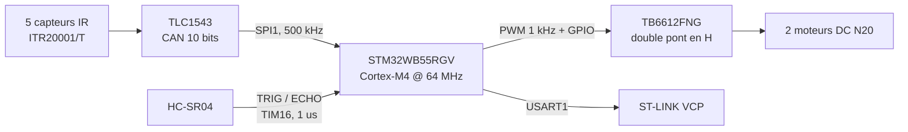

# Robot suiveur de ligne — AlphaBot2-AR / STM32WB55

Bureau d'Études Microcontrôleur STM32 — **Master 1 SME**, Département EEA,
Université Toulouse III Paul Sabatier, année 2025–2026 — **groupe 23**.

Firmware d'un robot mobile autonome qui suit une ligne noire tracée au sol et
détecte les obstacles frontaux, développé sur la plateforme Waveshare
AlphaBot2-AR pilotée par un STM32WB55RGV.

**Auteurs :** ARAGONES Alexandre, FLORENS Mathieu

📄 [Rapport complet (PDF)](Docs/Rapport/rapport_BE_ARAGONES_FLORENS.pdf)

---

## Cahier des charges

| # | Exigence |
|---|---|
| FP1 | Suivre une ligne noire au sol de manière autonome |
| FP2 | Détecter et éviter les obstacles frontaux |
| FS1 | Acquérir la position de la ligne — 5 capteurs IR ITR20001/T → TLC1543 → SPI |
| FS2 | Mesurer la distance à un obstacle — HC-SR04 → GPIO / Timer |
| FS3 | Piloter les deux moteurs DC en vitesse et direction — TB6612FNG → PWM / GPIO |
| FS4 | Exécuter la boucle de décision à 100 Hz |
| FS5 | Fournir une interface de débogage temps réel — UART → ST-LINK |

Seuil de détection d'obstacle : **15 cm**. Période de la boucle de contrôle : **10 ms**.

---

## Chaîne fonctionnelle



---

## Matériel

| Élément | Référence | Rôle |
|---|---|---|
| Microcontrôleur | STM32WB55RGV (Cortex-M4 @ 64 MHz, 1 Mo Flash, 256 Ko SRAM) | traitement et décision |
| Châssis | Waveshare AlphaBot2-AR | plateforme mobile 2 roues |
| Driver moteurs | Toshiba TB6612FNG | double pont en H, 1,2 A/canal |
| Convertisseur A/N | Texas Instruments TLC1543 | 10 bits, 11 canaux, interface série 3 fils |
| Capteurs de ligne | 5 × ITR20001/T | réflectométrie infrarouge |
| Télémètre | HC-SR04 | distance par ultrasons, 2 cm à 400 cm |

L'horloge système est obtenue par la PLL depuis le MSI à 4 MHz : 4 × 32 / 2 = **64 MHz**.

---

## Brochage

| Broche | Label | Fonction | Périphérique |
|---|---|---|---|
| PA8 | — | PWM moteur droit | TIM1_CH1 |
| PA15 | — | PWM moteur gauche | TIM2_CH1 |
| PA0 / PA1 | `MOT_D_DIR2` / `MOT_D_DIR1` | direction moteur droit | GPIO |
| PC0 / PC1 | `MOT_G_DIR2` / `MOT_G_DIR1` | direction moteur gauche | GPIO |
| PA4 | `IR_CS` | chip select du TLC1543 | GPIO |
| PA5 / PA6 / PA7 | `SPI1_SCK` / `MISO` / `MOSI` | bus SPI vers le TLC1543 | SPI1 |
| PA10 | `TRIG` | déclenchement HC-SR04 | GPIO |
| PC6 | `ECHO` | mesure de l'écho | GPIO + TIM16 |
| PB6 / PB7 | `STLINK_RX` / `STLINK_TX` | console de débogage | USART1 |

---

## Deux points techniques

**Lecture du TLC1543 en pipeline.** Le convertisseur ne renvoie pas la valeur du
canal qu'on lui demande : à chaque échange SPI on transmet l'adresse du canal
*suivant* et on reçoit le résultat de la conversion *précédente*. La valeur
10 bits se reconstruit sur deux octets :

```c
txData[0] = (canal << 4);            /* adresse sur les 4 bits de poids fort */
txData[1] = 0x00;
valeur = ((rxData[0] & 0x0F) << 6) | (rxData[1] >> 2);
```

**Mesure de distance au microseconde près.** TIM16 est prescalé à
`PSC = 63` sur une horloge de 64 MHz, soit exactement 1 tick = 1 µs. La distance
se déduit alors directement de la durée du signal ECHO :

```
Distance (cm) = duree_ECHO (µs) × 0,017
```

---

## Arborescence

```
STM32_2026_G23/
├── Firmware/
│   ├── BE_ROBOT/       projet final — STM32WB55RGV
│   │   └── Core/Src/
│   │       ├── main.c         boucle de decision a 100 Hz
│   │       ├── infrarouge.c   lecture des 5 capteurs via TLC1543 (SPI)
│   │       ├── ultrason.c     mesure de distance HC-SR04 (TIM16)
│   │       └── motor.c        pilotage TB6612FNG (PWM + GPIO)
│   ├── TEMP/           etape preliminaire — capteur SHT31 (I2C) sur afficheur LCD
│   └── ULTRASON/       etape preliminaire — HC-SR04 sur afficheur LCD
└── Docs/
    ├── Datasheets/     documentations constructeurs et schema AlphaBot2
    └── Rapport/        compte rendu de Bureau d'Etudes (PDF)
```

`TEMP` et `ULTRASON` sont les deux manipulations préparatoires, réalisées sur
carte **Nucleo-L476RG** avant le passage sur l'AlphaBot2 : elles ont servi à
prendre en main l'I2C, les timers et l'affichage avant d'intégrer les capteurs
dans le robot.

---

## Compiler et flasher

1. STM32CubeIDE → *File* → *Import* → *Existing Projects into Workspace*
2. Pointer sur `Firmware/` : les trois projets sont détectés, importer celui voulu
3. *Build*, puis *Run* avec la carte branchée en USB

---

## Validation expérimentale

Les signaux ont été relevés au **PicoScope 6** et confrontés aux valeurs théoriques :

| Grandeur | Théorique | Mesuré |
|---|---|---|
| Fréquence PWM moteurs | 1 000 Hz | ~1 000 Hz ✓ |
| Amplitude | 3,3 V | 3,3 V ✓ |
| Rapport cyclique (CCR = 500) | 50,0 % | 50,01 % ✓ |
| Fréquence SPI | 500 kHz | compatible TLC1543 (max 2,1 MHz) ✓ |

L'algorithme de suivi de ligne fonctionne sur les cas nominaux.

---

## Perspectives

Deux évolutions se dégagent du travail réalisé. D'abord un correcteur
proportionnel, voire PID, pour le suivi de ligne : la position pondérée des cinq
capteurs infrarouges fournit une erreur continue exploitable, là où la décision
actuelle en tout-ou-rien provoque des oscillations en virage. Ensuite l'activation
du **BLE 5.0** du STM32WB55, qui permettrait de régler seuils, vitesses et gains
sans reflasher la carte.

L'analyse critique complète du firmware figure dans le rapport.

---

## Références

* STMicroelectronics — **DS11929** : STM32WB55xx datasheet
* STMicroelectronics — **RM0434** : STM32WB55 Reference Manual
* Texas Instruments — **SLAS090D** : TLC1543, 11-Channel 10-Bit ADC
* Toshiba — **TB6612FNG** : Dual DC Motor Driver IC
* Waveshare — AlphaBot2-AR, wiki et schéma électronique officiel

Toutes ces documentations sont rassemblées dans [`Docs/Datasheets/`](Docs/Datasheets).
